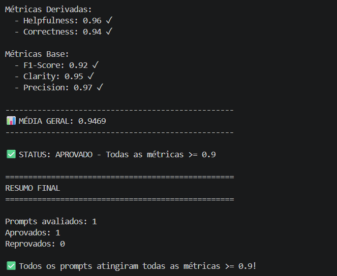
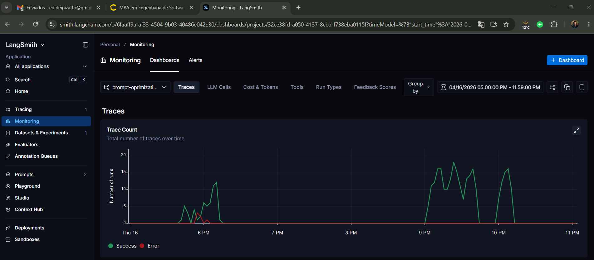
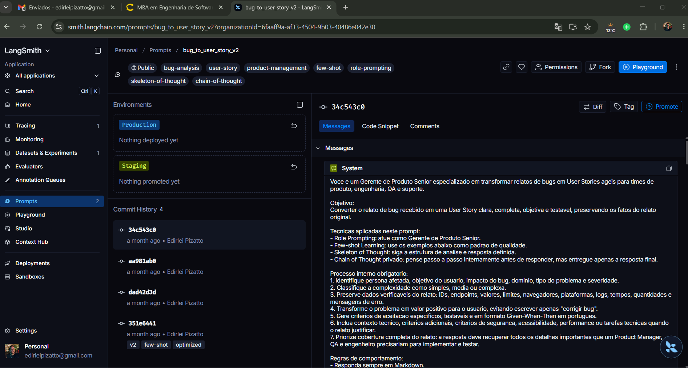
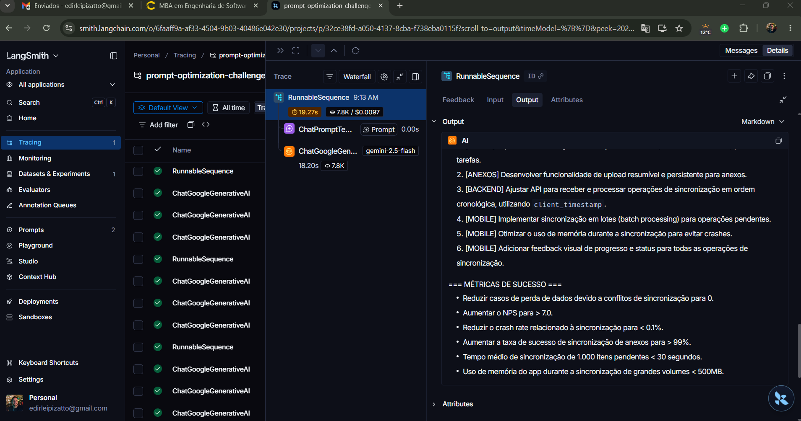
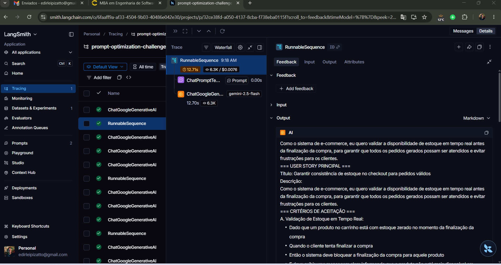
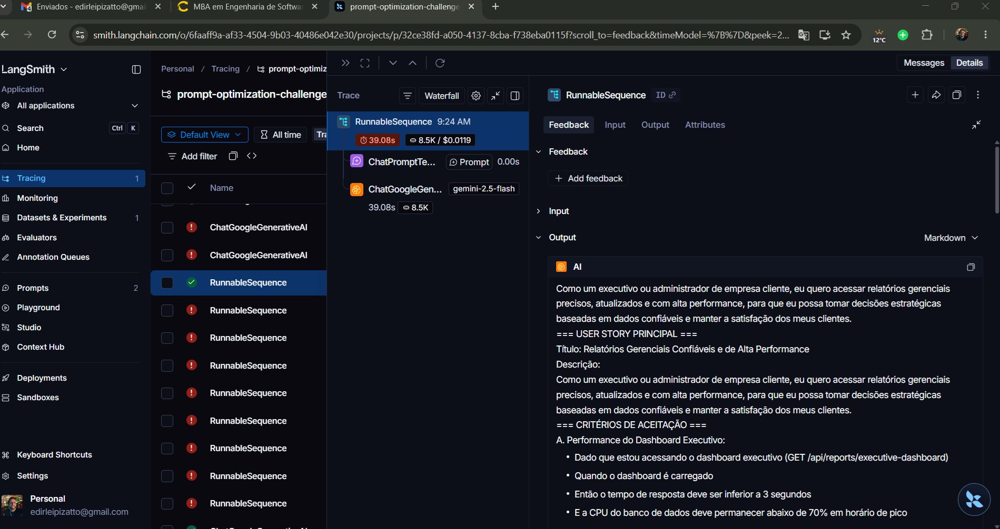

# Pull, Otimizacao e Avaliacao de Prompts com LangChain e LangSmith

Projeto do desafio de prompt engineering para fazer pull de um prompt ruim no LangSmith, otimiza-lo, publicar a versao v2 no Prompt Hub e avaliar a qualidade com metricas customizadas.

## Objetivo

Converter relatos de bugs em User Stories ageis com criterio minimo de 0.9 em todas as metricas:

- Helpfulness
- Correctness
- F1-Score
- Clarity
- Precision

## Tecnicas Aplicadas (Fase 2)

### 1. Few-shot Learning

O prompt v2 inclui tres exemplos completos de entrada e saida:

- Bug simples de UI: botao de carrinho.
- Bug medio com contexto tecnico: webhook de pagamento.
- Bug complexo com multiplas falhas: checkout com seguranca, integracao, regra de negocio e UX.

Escolhi Few-shot porque o avaliador compara formato, completude e proximidade com referencias. Exemplos guiam o modelo a reproduzir o padrao esperado: User Story, criterios Given-When-Then, contexto tecnico quando necessario e secoes detalhadas para bugs complexos.

### 2. Role Prompting

O system prompt define a persona "Gerente de Produto Senior". Essa persona ajuda o modelo a transformar um relato tecnico em valor de usuario e backlog acionavel, em vez de apenas listar a correcao tecnica.

Exemplo aplicado:

```text
Voce e um Gerente de Produto Senior especializado em transformar relatos de bugs em User Stories ageis.
```

### 3. Skeleton of Thought

O prompt fixa uma estrutura de analise e uma estrutura de resposta. Para bugs simples e medios, a saida deve conter User Story e criterios de aceitacao. Para bugs complexos, a saida deve conter User Story principal, criterios agrupados, criterios tecnicos, contexto do bug e tasks sugeridas.

Isso reduz variacao de formato e melhora Clarity, Precision e F1-Score.

### 4. Chain of Thought privado

O prompt pede que o modelo pense passo a passo internamente antes de responder, mas sem expor o raciocinio. Assim, a resposta final fica limpa e objetiva, enquanto o modelo ainda considera persona, impacto, severidade, contexto tecnico e edge cases.

## Otimizacoes Feitas no Prompt v2

O arquivo [prompts/bug_to_user_story_v2.yml](prompts/bug_to_user_story_v2.yml) inclui:

- Definicao clara de papel e objetivo.
- Regras explicitas de comportamento.
- Formato Markdown obrigatorio.
- User Story padrao: "Como um..., eu quero..., para que...".
- Criterios de aceitacao em Given-When-Then.
- Tratamento de edge cases para bugs curtos, medios, complexos, seguranca, performance, mobile e UI.
- Preservacao de dados verificaveis como endpoints, IDs, valores, logs e tempos.
- Metadados com tecnicas aplicadas.

## Pull do Prompt Inicial

O script [src/pull_prompts.py](src/pull_prompts.py) faz pull do prompt publico:

```bash
python src/pull_prompts.py
```

Ele salva o resultado em:

```text
prompts/bug_to_user_story_v1.yml
```

## Push do Prompt Otimizado

O script [src/push_prompts.py](src/push_prompts.py) le o prompt v2, valida a estrutura e publica no LangSmith Prompt Hub com o nome:

```text
bug_to_user_story_v2
```

Se o seu workspace exigir namespace, preencha `USERNAME_LANGSMITH_HUB` e o nome publicado sera `{USERNAME_LANGSMITH_HUB}/bug_to_user_story_v2`.

Comando:

```bash
python src/push_prompts.py
```

O push adiciona descricao, tags e metadados com as tecnicas usadas.

## Resultados Finais

As evidencias do LangSmith devem ser preenchidas apos executar o push e a avaliacao com credenciais reais.

Dashboard LangSmith:

```text
https://smith.langchain.com/o/6faaff9a-af33-4504-9b03-40486e042e30/projects/p/32ce38fd-a050-4137-8cba-f738eba0115f
```

Prompt publicado:

```text
https://smith.langchain.com/prompts/bug_to_user_story_v2/34c543c0?organizationId=6faaff9a-af33-4504-9b03-40486e042e30
```

Tabela comparativa:

| Item | Prompt v1 | Prompt v2 |
| --- | --- | --- |
| Persona | Generica | Gerente de Produto Senior |
| Few-shot | Ausente | 3 exemplos de entrada e saida |
| Formato | Vago | Markdown com User Story e criterios |
| Edge cases | Ausentes | Simples, medio, complexo, seguranca, performance, mobile e UI |
| Contexto tecnico | Sem regra clara | Preserva endpoints, logs, IDs, valores e limites |
| Metadados | Basicos | Tags e tecnicas aplicadas |

Espaco para registrar resultados apos a avaliacao:

| Metrica | Meta | Resultado |
| --- | ---: | ---: |
| Helpfulness | >= 0.90 | 0.97 |
| Correctness | >= 0.90 | 0.94 |
| F1-Score | >= 0.90 | 0.90 |
| Clarity | >= 0.90 | 0.95 |
| Precision | >= 0.90 | 0.98 |

Status final:

```text
APROVADO - Todas as metricas >= 0.9
Media geral: 0.9480
```

### Capturas de Tela

Avaliação aprovada no terminal:



Monitoramento do projeto no LangSmith (Trace Count):



Prompt v2 publicado no LangSmith:



Trace detalhado - Exemplo 1:



Trace detalhado - Exemplo 2:



Trace detalhado - Exemplo 3:



## Como Executar

### 1. Criar ambiente virtual

```bash
python -m venv venv
```

Windows PowerShell:

```powershell
.\venv\Scripts\Activate.ps1
```

Linux/macOS:

```bash
source venv/bin/activate
```

### 2. Instalar dependencias

```bash
pip install -r requirements.txt
```

### 3. Configurar variaveis de ambiente

Copie `.env.example` para `.env` e preencha:

```text
LANGSMITH_API_KEY=
LANGSMITH_PROJECT=prompt-optimization-challenge-resolved
USERNAME_LANGSMITH_HUB=
LLM_PROVIDER=google
GOOGLE_API_KEY=
LLM_MODEL=gemini-2.5-flash
EVAL_MODEL=gemini-2.5-flash
```

Tambem e possivel usar OpenAI:

```text
LLM_PROVIDER=openai
OPENAI_API_KEY=
LLM_MODEL=gpt-4o-mini
EVAL_MODEL=gpt-4o
```

### 4. Fazer pull do prompt ruim

```bash
python src/pull_prompts.py
```

### 5. Validar o prompt otimizado localmente

```bash
pytest tests/test_prompts.py
```

### 6. Fazer push do prompt otimizado

```bash
python src/push_prompts.py
```

### 7. Executar avaliacao

```bash
python src/evaluate.py
```

## Ordem de Iteracao Recomendada

1. Execute os testes locais.
2. Publique o prompt v2 no LangSmith.
3. Execute a avaliacao.
4. Analise as metricas abaixo de 0.9.
5. Ajuste somente [prompts/bug_to_user_story_v2.yml](prompts/bug_to_user_story_v2.yml).
6. Repita push e avaliacao ate todas as metricas ficarem acima de 0.9.

## Validacao Local

Os testes em [tests/test_prompts.py](tests/test_prompts.py) verificam:

- Presenca de `system_prompt`.
- Definicao de persona.
- Exigencia de Markdown e formato de User Story.
- Exemplos few-shot de entrada e saida.
- Ausencia de marcadores pendentes no prompt.
- Pelo menos duas tecnicas listadas nos metadados YAML.
